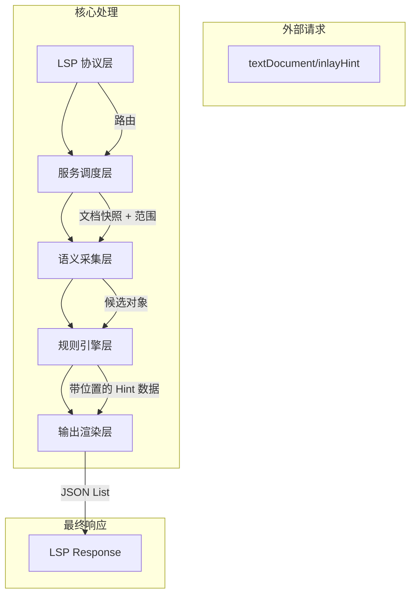

```mermaid
graph TD
    A[LSP 协议层] --> B[服务调度层]
    B --> C[语义采集层]
    C --> D[规则引擎层]
    D --> E[输出渲染层]
    
    subgraph "外部请求"
    Req[textDocument/inlayHint]
    end
    
    subgraph "核心处理"
    A -->|路由 | B
    B -->|文档快照 + 范围 | C
    C -->|候选对象 | D
    D -->|带位置的 Hint 数据 | E
    end
    
    subgraph "最终响应"
    E -->|JSON List | Resp[LSP Response]
    end
```