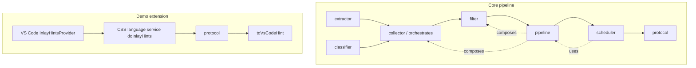

```mermaid
flowchart TD
  subgraph Core[Core pipeline]
    Extractor[extractor] --> Collector[collector / orchestrates]
    Classifier[classifier] --> Collector
    Collector --> Filter[filter]
    Filter --> Pipeline[pipeline]
    Pipeline --> Scheduler[scheduler]
    Scheduler --> Protocol[protocol]
  end

  subgraph Demo[Demo extension]
    VSCode[VS Code InlayHintsProvider] --> LS[CSS language service doInlayHints]
    LS --> DemoFilter[protocol]
    DemoFilter --> VSCodeHints[toVsCodeHint]
  end

  Scheduler -.uses.-> Pipeline
  Pipeline -.composes.-> Collector
  Pipeline -.composes.-> Filter
```