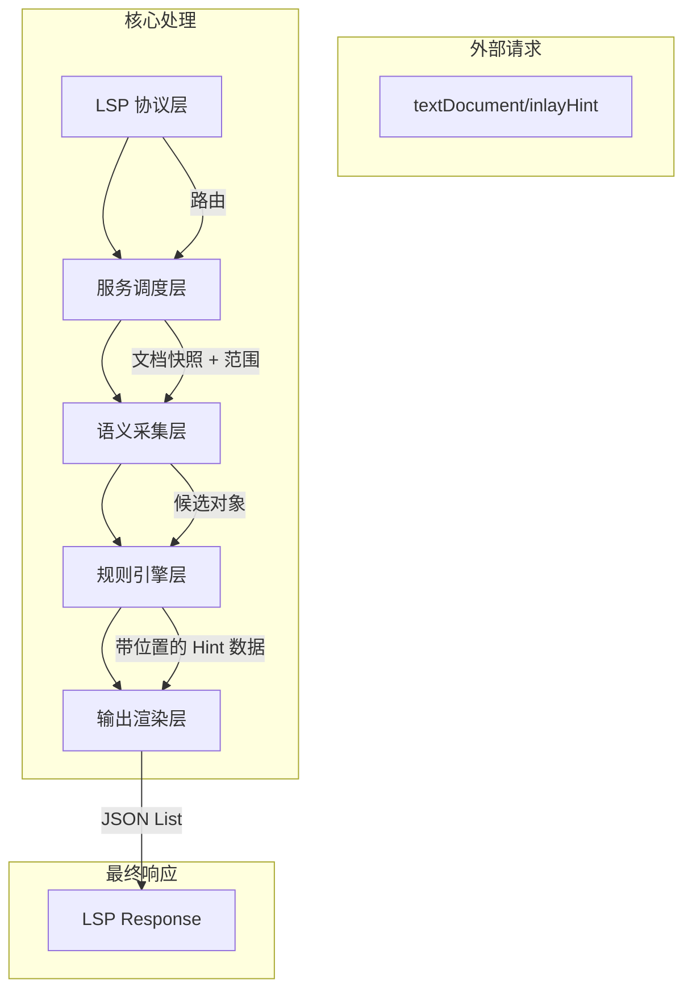

基于你对 clangd 源码的深度解析（`重写关键调度链.md`），我们可以非常清晰地提炼出一套**工业级 LSP 服务器架构**。CSS 虽然语义比 C++ 简单，但要想达到 `clangd` 那样的稳定性和扩展性，**架构分层**和**关注点分离**是核心。

以下是基于 clangd 经验定制的 **CSS Inlay Hint LSP 架构设计**。

---

### 一、核心设计哲学：继承与裁剪

#### 1. 必须学习 clangd 的部分（架构骨架）
*   **分层解耦：** 严格区分 **协议层 (LSP)**、**调度层 (Service)**、**语义层 (Semantic)**、**输出层 (Output)**。不要让 LSP 协议细节污染业务逻辑。
*   **Visitor 模式：** 使用访问者模式遍历 AST/PSI 树，将“遍历结构”与“Hint 规则”分离。
*   **候选筛选链 (Filtering Chain)：** 像 `processCall` 一样，先收集候选，再经过多层过滤（配置、显式值、低价值场景），最后才生成 Hint。
*   **落点稳定性 (Placement Stability)：** 像 `computeBlockEndHintRange` 一样，Hint 的显示位置必须经过严格校验（是否在可视范围、是否重叠），位置不稳宁可不发。
*   **配置驱动 (Config-Driven)：** 像 `Config::current()` 一样，所有 Hint 行为应可通过配置开关，支持灰度发布。

#### 2. 对 CSS 来说不必要的部分（裁剪复杂度）
*   **重型索引 (Heavy Indexing)：** CSS 不需要像 C++ 那样的跨文件符号索引（Index AST）。CSS 变量作用域相对简单，V1 版本可仅支持当前文件。
*   **隐式代码处理 (Implicit Code)：** CSS 没有 C++ 那样的隐式构造函数或模板实例化，不需要 `shouldVisitImplicitCode` 这种复杂逻辑。
*   **编译数据库 (Compilation Database)：** CSS 是解释型样式表，不需要 `compile_commands.json`，启动更快。
*   **复杂类型推导 (Type Resolution)：** CSS 没有泛型、模板、重载解析。语义推导主要集中在 **简写展开 (Shorthand Expansion)** 和 **变量引用 (Variable Reference)**。

---

### 二、明确的分层架构设计

我们将架构分为五层，自顶向下分别是：

#### 1. LSP 协议层 (Protocol Layer)
*   **clangd 参考：** `ClangdLSPServer::bindMethods`, `onInlayHint`
*   **职责：** 仅负责 LSP 消息的路由、参数解析、能力协商。
*   **CSS 实现：**
    *   使用 `vscode-languageserver-node` 搭建标准服务器。
    *   注册 `textDocument/inlayHint` 处理函数。
    *   **关键点：** 这一层**不包含任何 CSS 逻辑**，只负责把 `URI + Range` 传给服务层。

##### 红灯测试
*   `test/protocolLayer/registersInlayHintRoute`
    *   初始化协议层后，必须能注册 `textDocument/inlayHint` 路由，且注册表里能查到该方法。
    *   参考 clangd：`ClangdLSPServer::bindMethods`
*   `test/protocolLayer/doesNotBindFeatureLogicIntoProtocolLayer`
    *   协议层只能把请求透传到服务层，不允许直接读 CSS AST、规则配置或任何 hint 语义结果。
    *   参考 clangd：`ClangdLSPServer::onInlayHint`
*   `test/protocolLayer/forwardsUriAndRangeUnchanged`
    *   收到 `textDocument/inlayHint` 请求时，`uri` 与 `range` 必须原样传给下一层，不得在协议层做语义转换。
    *   参考 clangd：`ClangdLSPServer::onInlayHint`, `ClangdLSPServer::onClangdInlayHints`
*   `test/protocolLayer/rejectsUnsupportedMethod`
    *   未注册的方法必须直接报错或拒绝分发，不能默默吞掉请求。
    *   参考 clangd：`MessageHandler::onCall`
*   `test/protocolLayer/advertisesOnlySupportedCapabilities`
    *   初始化时只宣告当前协议层真正支持的能力，未实现的能力不能提前暴露给编辑器。
    *   参考 clangd：`ClangdLSPServer::onInitialize`

#### 2. 服务调度层 (Service Scheduler)
*   **clangd 参考：** `ClangdServer::inlayHints`, `WorkScheduler`
*   **职责：** 管理文档快照、并发控制、取消请求、AST/PSI 获取。
*   **CSS 实现：**
    *   **文档快照：** 确保分析的是编辑器当前内存中的最新内容，而不是磁盘文件。
    *   **并发控制：** 用户打字很快，如果新的请求来了，旧的请求必须被取消（Cancellation Token）。
    *   **PSI 获取：** 调用 `vscode-css-languageservice` 解析 CSS 文本，生成 AST。
    *   **关键点：** 保证“输入给核心层的数据是稳定且最新的”。

##### 红灯测试
*   `test/serviceScheduler/usesInMemoryDraftNotDiskFile`
    *   先打开文档并在内存里修改，再不保存磁盘文件；调度层必须读取最新 draft，而不是旧磁盘内容。
    *   参考 clangd：`ClangdServer::addDocument`, `ClangdServer::getDraft`, `ClangdServer::inlayHints`
*   `test/serviceScheduler/cancelsStaleRequestWhenNewEditArrives`
    *   连续发起两次请求，中间插入一次新编辑；旧请求必须被取消或忽略，不能返回基于过时快照的结果。
    *   参考 clangd：`TUScheduler::runWithAST`, `ClangdLSPServer::onCall`, `cancelableRequestContext`
*   `test/serviceScheduler/doesNotAnswerClosedDocument`
    *   先打开再关闭文档；关闭后再触发相关请求，调度层不能继续返回该文件的 AST/Hint 结果。
    *   参考 clangd：`ClangdServer::removeDocument`, `ClangdLSPServer::onDocumentDidClose`

#### 3. 语义采集层 (Semantic Collector)
*   **clangd 参考：** `InlayHintVisitor`, `TraverseDecl`, `VisitCallExpr`
*   **职责：** 遍历 CSS AST，识别潜在的 Hint 位置（如属性声明节点），提取原始数据。
*   **CSS 实现：**
    *   **Visitor 模式：** 实现 `CssHintVisitor`，遍历 `Stylesheet` -> `Ruleset` -> `Declaration`。
    *   **候选提取：** 当遇到 `Property: Value` 结构时，提取 `PropertyName`, `ValueTokens`, `Range`。
    *   **变量预解析：** 如果值包含 `var(--x)`，尝试在当前文件符号表中解析 `--x` 的值（V1 可跳过，V2 实现）。
    *   **关键点：** 这一层只负责“发现”，不负责“判断”。比如发现 `margin: 10px 20px`，提取出 `margin` 和两个值节点，但不决定显示什么标签。

#### 4. 规则引擎层 (Rule Engine) —— **核心业务**
*   **clangd 参考：** `processCall`, `shouldHintName`, `chooseParameterNames`
*   **职责：** 对候选数据进行匹配、过滤、语义映射。
*   **CSS 实现：**
    *   **数据驱动：** 加载 JSON 配置文件（定义 `margin`, `flex` 等属性的简写规则）。
    *   **匹配逻辑：**
        *   输入：`property='margin'`, `tokens=[10px, 20px]`
        *   规则：`margin` 是简写，2 个值 -> 映射为 `['top/bottom', 'left/right']`
    *   **过滤逻辑：**
        *   全局值过滤：`inherit`, `initial` 不显示 Hint。
        *   显式值过滤：如果用户写了 `margin-top: 10px`，不再显示简写 Hint。
        *   变量未知过滤：如果 `var(--x)` 解析失败， suppress hint。
    *   **关键点：** 这是唯一需要频繁更新的地方。新增 CSS 属性只需更新 JSON 规则，无需改代码。

#### 5. 输出渲染层 (Output Renderer)
*   **clangd 参考：** `addInlayHint`, `getHintRange`, `computeBlockEndHintRange`, `dedupeAndSort`
*   **职责：** 计算最终显示位置、格式化文本、去重、排序。
*   **CSS 实现：**
    *   **落点计算：** 确保 Hint 挂在值的后面（Right）或前面（Left），且不覆盖原有代码。
    *   **可见性检查：** 确保 Hint 位置在 LSP 请求的 `range` 内。
    *   **去重排序：** 同一位置不要显示多个 Hint，按位置顺序排序。
    *   **关键点：** 保证“显示的 Hint 不会让编辑器 UI 错乱”。

---

### 三、关键模块详细设计对照表

| 模块         | clangd 参考实现              | CSS Hinter 设计建议                     | 差异说明                                    |
| :----------- | :--------------------------- | :-------------------------------------- | :------------------------------------------ |
| **入口路由** | `bindMethods`                | 使用 `vscode-languageserver` 标准注册   | CSS 不需要 clangd 特有的扩展协议            |
| **任务调度** | `WorkScheduler::runWithAST`  | 基于 Promise 的异步队列 + 取消 Token    | CSS 解析快，不需要复杂的线程池，但需要防抖  |
| **AST 遍历** | `RecursiveASTVisitor`        | 基于 `css-languageservice` 的 AST 遍历  | CSS 树更浅，不需要处理模板/宏等隐式节点     |
| **语义归一** | `processCall` (Callee+Args)  | `processDeclaration` (Property+Values)  | C++ 归一化函数调用，CSS 归一化属性声明      |
| **规则判断** | `shouldHintName`, `isSetter` | `matchesShorthandRule`, `isGlobalValue` | C++ 判断语义价值，CSS 判断语法结构          |
| **位置计算** | `computeBlockEndHintRange`   | `computeValueHintRange`                 | C++ 关注块尾 `}`，CSS 关注值末尾 `;` 或行尾 |
| **配置管理** | `Config::current()`          | `HintConfig` (JSON 加载)                | CSS 规则更适合外部配置化，方便热更新        |

---

### 四、针对 CSS 特性的特别设计

基于你之前提到的“求真值、继承、覆盖、引用”问题，我们在架构中这样处理：

1.  **引用 (Variables)：**
    *   在 **语义采集层** 增加一个 `VariableResolver` 模块。
    *   策略：保守处理。如果 `var(--x)` 无法在当前文件解析，**不显示 Hint**（Suppress），而不是显示错误 Hint。
2.  **覆盖 (Override) & 继承 (Inheritance)：**
    *   **策略：忽略。**
    *   理由：Inlay Hint 是**语法辅助**，不是**运行时调试**。用户写 `margin: 10px` 时，即使它被下一行覆盖了，提示 `/* all */` 依然是正确的语法提示。覆盖检测属于 `Diagnostics`（报错/警告）范畴。
3.  **求真值 (Computed Value)：**
    *   **策略：不做。**
    *   理由：这是浏览器 DevTools 的工作。LSP 服务器不应承担浏览器引擎的计算职责（性能开销大且不准确）。我们只做**静态语法展开**。

---

### 五、开发路线图 (Roadmap)

基于分层架构，建议分阶段实施：

*   **Phase 1: 骨架搭建 (Skeleton)**
    *   实现 LSP 协议层和服务调度层。
    *   打通 `Request -> Parse -> Empty Response` 链路。
    *   目标：VS Code 和 Neovim 能连接上服务器，不报错。
*   **Phase 2: 核心规则 (Core Rules)**
    *   实现语义采集层（遍历 AST）。
    *   实现规则引擎层（仅支持 `margin`, `padding` 的 1-4 值展开）。
    *   实现输出渲染层（基础位置计算）。
    *   目标：写 `margin: 10px 20px;` 能看到 `/* top/bottom */ /* left/right */`。
*   **Phase 3: 规则扩展 (Expansion)**
    *   引入 JSON 配置文件，支持 `flex`, `grid`, `border` 等复杂属性。
    *   实现过滤逻辑（全局值、显式值抑制）。
    *   目标：覆盖 80% 常用简写属性。
*   **Phase 4: 语义增强 (Semantic)**
    *   实现 `VariableResolver`，支持 `var(--x)` 的简单展开。
    *   优化落点稳定性（处理多行值、注释等情况）。
    *   目标：达到工业级可用性。

### 六、总结

你的 clangd 源码分析非常到位。**CSS Hinter 的成功关键在于“克制”**：
1.  **克制语义范围：** 只做静态语法提示，不做运行时计算。
2.  **克制代码逻辑：** 多用配置数据，少写硬编码 `if/else`。
3.  **克制显示欲望：** 位置不稳、信息重复时，宁可隐藏 Hint。

按照这个分层设计，你不仅能复刻 `clangd` 的稳定性，还能避免陷入 CSS 复杂层叠逻辑的泥潭。这是一个非常务实且可落地的方案。